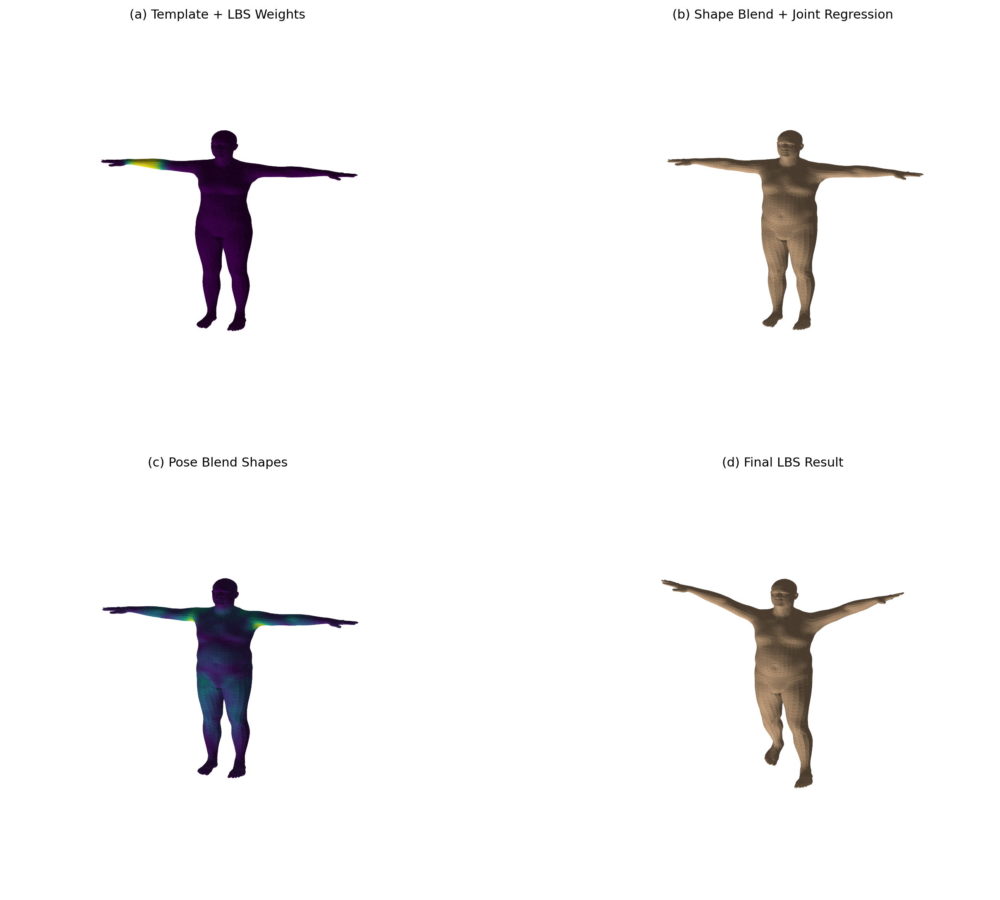
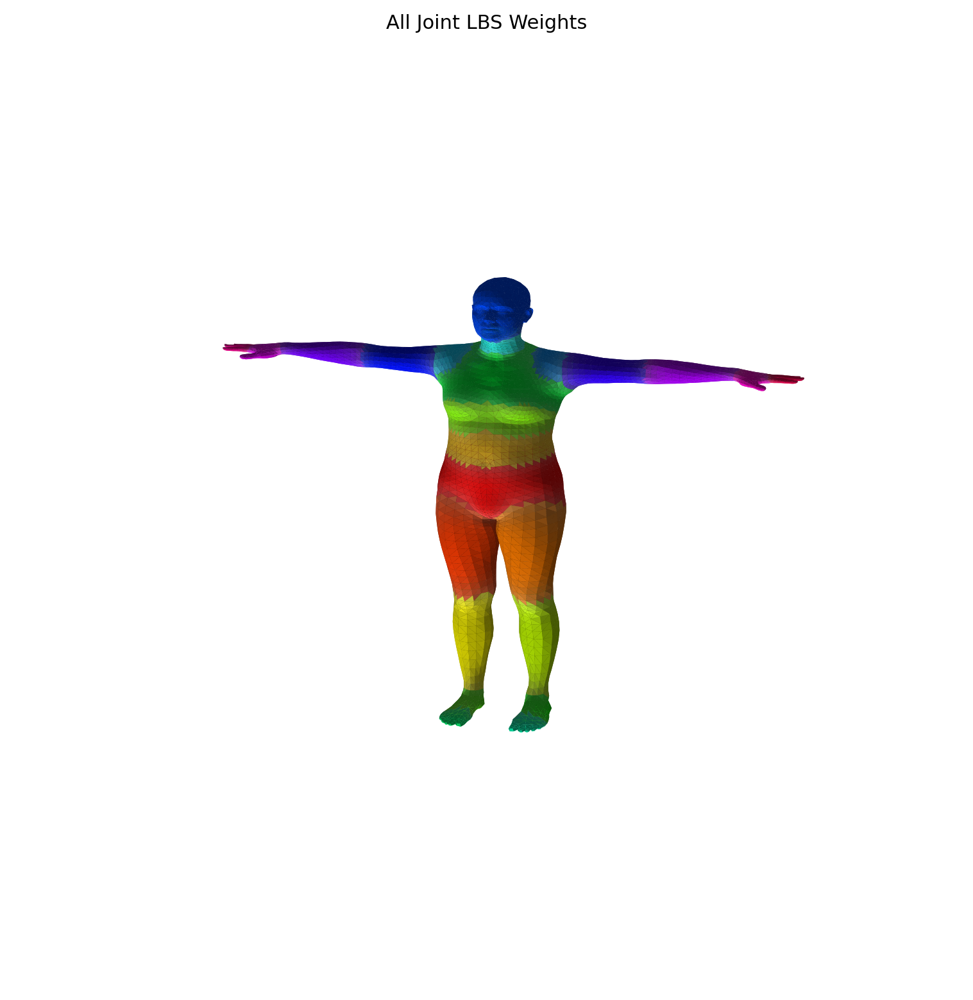

# SMPL LBS : 3D 人体线性混合蒙皮与可视化实验
## 徐子晴 202411081056 计算机科学与技术
本项目基于 `smplx` 库与 Python 数据科学工具链（PyTorch, NumPy, Matplotlib），完整复现了 SMPL 模型的线性混合蒙皮（Linear Blend Skinning, LBS）算法流程。通过脱离官方高层 API，手动实现形状混合、姿态校正、关节回归与蒙皮变形，并对过程进行逐阶段 3D 可视化，验证了 LBS 算法底层数学原理的准确性。

## 目录

- [项目概述](#项目概述)
- [项目架构](#项目架构)
- [代码逻辑](#代码逻辑)
  - [数据兼容层与模型加载](#数据兼容层与模型加载)
  - [手写 LBS 核心计算 ](#手写-lbs-核心计算)
  - [3D 可视化与绘图模块](#3d-可视化与绘图模块)
  - [参数配置与执行入口](#参数配置与执行入口)
- [实现功能](#实现功能)
- [效果展示](#效果展示)

## 项目概述

**SMPL-LBS-Lab** 是一个图形学与三维人体建模基础实验项目，旨在深入理解 SMPL 模型的骨架驱动变形机制。作为核心任务，本项目在不依赖 `smplx` 高层 `forward()` 方法的前提下，手动完成从模板网格到最终蒙皮网格的全部计算过程，并通过 Matplotlib 输出包含关节权重、形状变形、姿态偏移等信息的 3D 图像，同时与官方结果进行数值对比验证。


## 项目架构

本项目为单脚本运行模式（Standalone Script），依赖外部模型文件，结构清晰：

```
SMPL-LBS-Lab/
├── run_lbs_lab.py               # 主程序（集成了数据加载、算法实现与可视化）
├── models/                      # 模型存放目录（需用户自行准备）
│   └── smpl/
│       └── SMPL_NEUTRAL.pkl     # SMPL 中性体模型文件
└── outputs/                     # 输出结果目录（程序自动创建）
    ├── stage_a_template_weights.png
    ├── stage_b_shaped_joints.png
    ├── stage_c_pose_offsets.png
    ├── stage_d_lbs_result.png
    ├── comparison_grid.png
    ├── all_joint_weights.png
    └── summary.txt
```

## 代码逻辑

### 数据兼容层与模型加载

- **`install_chumpy_pickle_shim()`**：为解决历史遗留问题，实现了一个适配器补丁，通过创建伪模块 `chumpy`，使得旧版 `.pkl` 格式的 SMPL 模型文件可以在无需安装 `chumpy` 库的情况下被 `pickle` 成功加载。
- **模型初始化**：调用 `smplx.create` 读取指定路径的模型，提取顶点索引、面片索引及 LBS 权重矩阵等核心数据。

### 手写 LBS 核心计算 

按 SMPL 论文标准流程，手动分步实现蒙皮运算：

1. **形状混合 (Shape Blend)**：将形状参数 `betas` 作用于 `shapedirs`，得到形状变形后的网格 `v_shaped`。
2. **关节回归 (Joint Regression)**：基于变形后的网格顶点，通过回归矩阵 `J_regressor` 计算出静止姿态下的 24 个关节点坐标 `J`。
3. **姿态混合形状 (Pose Blend Shapes)**：将关节旋转矩阵转换为轴角特征，乘以 `posedirs` 得到姿态偏移量，叠加在形状网格上得到 `v_posed`。
4. **刚性层级变换与 LBS 蒙皮**：计算各关节的全局变换矩阵 `A`，结合 LBS 权重矩阵 `W`，将每个顶点从静止姿态映射到目标姿态，得出最终变形网格 `verts`。
5. **数值验证**：通过 `compare_with_official_forward()` 将手写结果与官方 `model()` 推理结果逐顶点比较，输出绝对误差。

### 3D 可视化与绘图模块

- **坐标转换与着色 (`smpl_to_plot_coords`, `shade_face_colors`)**：将 SMPL 的右手坐标系变换为 Matplotlib 的 3D 绘图坐标系，并基于面法向量与光照方向计算明暗着色效果。
- **图例生成 (`get_face_colors_from_joint_weights`)**：根据 LBS 权重矩阵为每张面片分配颜色，展示不同关节的影响范围与权重分布。
- **多视角输出**：分别保存单阶段图像（Stage a, b, c, d）、四宫格对比图（`comparison_grid.png`）以及全关节权重图（`all_joint_weights.png`）。

### 参数配置与执行入口

- **`argparse` 命令行解析**：支持通过命令行传入 `--model-dir`（模型路径）、`--out-dir`（输出路径）、`--joint-id`（可视化特定关节权重）和 `--num-betas`（形状参数数量）。
- **示例姿态构建 (`build_demo_pose`)**：预定义了包含左右肘、肩、髋等主要关节旋转的初始姿态，用于演示蒙皮变形的效果。
- **日志摘要输出**：自动生成 `summary.txt`，记录顶点数、面片数、关节数及手写结果与官方结果的平均/最大绝对误差。

## 实现功能

- **无依赖加载旧版 SMPL 模型**：无需安装 `chumpy` 即可读取 `.pkl` 格式模型文件，降低环境配置门槛。
- **手写 LBS 算法全流程复现**：不依赖 `smplx` 库的高层封装，逐层还原形状、姿态与蒙皮矩阵计算过程，帮助深入理解底层数学原理。
- **官方结果数值校验**：生成平均绝对误差与最大绝对误差，精度可达 1e-7 级别，确保手写实现的正确性。
- **多维度数据可视化**：
  - **关节权重热力图**：直观展示单关节（如左肘关节）对全身网格顶点的影响范围。
  - **网格变形过程图**：分别输出形状混合、姿态偏移与 LBS 蒙皮阶段的网格结构。
  - **全关节权重分布图**：以不同颜色代表不同骨骼驱动区域，清晰展示多关节混合蒙皮效果。
- **单脚本一键运行**：集环境兼容、逻辑计算与可视化于一体，支持命令行参数化执行，适合作为教学实验工具。

## 效果展示

> 程序运行后将在指定输出目录中生成以下图像文件：
> 
> - **Stage A**：静止姿态网格 + 单关节权重热力图
> - **Stage B**：形状混合后网格 + 回归关节点
> - **Stage C**：姿态偏移后网格（着色显示位移大小）
> - **Stage D**：最终 LBS 蒙皮变形结果
> - **四宫格对比图**：将上述四阶段集于一图，便于系统性对比
> 
> - **全部关节权重图**：展示 24 个关节驱动顶点的权重分配情况
> 
